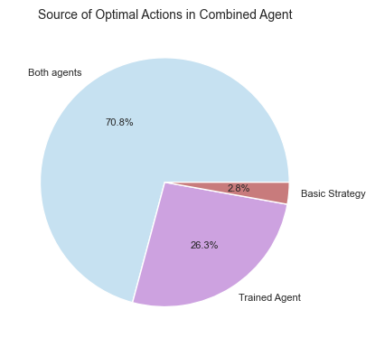

## Project Statement

This project aims to close the gap between the house edge and player's expected probability of winning. To do this, we look at the mathematically derived best way to play Blackjack: the basic strategy. This strategy outlines the best actions (out of hitting, standing, splitting, and doubling down) the player should take given their total hand value, whether they have aces, whether they can double, and the dealer's up-card. Then, we train a better model to play more optimally than this strategy. Therefore, the overarchiing hypothesis for this project is as follows:

*There is a better defined strategy than the basic strategy that improves its win rate and average returns.*

## Technical Details

### Blackjack Environment

- **Decks**: 6 standard decks (52 cards each), reshuffled after 2 decks drawn
- **Dealer rule**: Stands on soft 17
- **Player actions**:
  - Can double down on any 2-card hand
  - Can split only once (no re-splitting)
- **State space**: 600 possible combinations (`player_sum`, `dealer_visible`, `usable_ace`, `can_split`, `can_double`)
- **Assumption**: Environment is *Markovian* &rarr; modeled as a Markov Decision Process (MDP)

### Default Simulation
Each simulation, detailed in `run_simulation.py`, consists of, by default, 1 million Blackjack episodes. Each episode is a full round from dealing cards (sampling form the stochastic environment) until a terminal state is reached (win/loss/draw). 25 such simulations are run by default in `batch_runner.py` to reduce the standard error of the mean (SEM) for a more accurate estimate of the true expected return.

### Trained Agent

To validate the hypothesis, we implement an agent that represents a **model-free, on-policy Monte Carlo (MC) method** for learning optimal Blackjack strategy. The agent implements the **every-visit MC** method for policy evaluation and improvement that updates *Q-values* for every occurrence of a state-action pair within an episode. The fundamental equation being approximated is

$$
Q\left(s,a\right)\approx E\left[G_t|S_t=s,A_t=a\right]
$$

where $G_t$ is the return (i.e., cumulative discounted reward) from time $t$ onward. More information about the training procedure is given below:
- **Q-table**: Stores estimated returns for each state-action pair (5-tuple state)
- **Policy improvement**:
  - Backpropagation of returns ($G=G\gamma+r$) through completed episodes without discounting ($\gamma=1.0$)
  - Updates Q-values by sample averaging across visits
- **Action selection**:
  - $\epsilon$-greedy exploration with decaying $\epsilon$ balances exploration and exploitation
  - Action masking ensures only legal moves are considered

<p align="center">
    
</p>

The trained agent, basic strategy model, and a random baseline model are run over 25 stochastic simulations, each with 1 million episodes. The distribution of the averaged winrates and rewards for each of the runs for the trained agent and the basic strategy model are compared above. It is clear that the trained agent plays Blackjack statistically more optimally than the basic strategy model.

### Combined Agent

Although the hypothesis has been broadly validated, we now turn to a deeper analysis of the agents. Out of the 600 possible state combinations, we focus on where the trained agent and the basic strategy model agree on the same action. To explore this, we construct a combined agent that selects the optimal action on a state-by-state basis, recording which model each chosen action originates from.

<p align="center">
  <table align="center">
    <thead>
      <tr>
        <th><strong>Metric</strong></th>
        <th><strong>Combined Agent</strong></th>
        <th><strong>Trained Agent</strong></th>
        <th><strong>Basic Strat Baseline</strong></th>
        <th><strong>Random Baseline</strong></th>
      </tr>
    </thead>
    <tbody>
      <tr>
        <td><strong>Winrate</strong></td>
        <td>0.4081</td>
        <td>0.3987</td>
        <td>0.3891</td>
        <td>0.2696</td>
      </tr>
      <tr>
        <td><strong>Avg Return</strong></td>
        <td>-0.1097</td>
        <td>-0.1265</td>
        <td>-0.1512</td>
        <td>-0.4589</td>
      </tr>
    </tbody>
  </table>
</p>

The combined agent consistently outperforms all baselines, achieving the highest win rate and the best (least negative) average return. Compared to the trained agent alone, the combined approach yields a 0.94 percentage point gain in win rate and a 13.3% relative improvement in average return. Against the basic strategy model, these improvements grow to 1.90 percentage points and 27.4%, respectively.

<p align="center">
    
</p>

The pie chart highlights where these gains come from. Rather than relying solely on the trained agent, the combined approach leverages the strengths of both strategies—selecting the best action for each state. Interestingly, just 2.8% of the combined agent’s actions come from the basic strategy model, yet these contributions are precisely what drive the observed performance boost.

## Installation

First, clone the repository:

```bash
git clone git@github.com:BorgXQ/blackjack-optimizer.git
cd blackjack-optimizer
```
Second, depending on your operating system, activate a virtual environment:

```bash
python -m venv .venv
source .venv/bin/activate   # on Windows, use: .venv\Scripts\activate
```

Finally, install the dependencies:

```bash
pip install -r requirements.txt
```

## Usage

### Play Blackjack

If you're simply trying to play Blackjack against a computer, simply run the following:

```bash
python blackjack_game.py
```

### Run Simulation and Analysis

To run the default 25 simulations, input the following command:

```bash
python batch_runner.py
```

You can specify how many simulations to run by using the `--runs` parameter. Next, generate the possible state combinations by running the following:

```bash
python total_combinations.py
```

After running the two commands above, you can run all the cells in `analysis.ipynb` (there will be some intended errors beyond the later cells due to missing data). Aside from analyses, the script aggregates the best action-state combinations between the trained agent and basic strategy, creating a new CSV file with which you can perform optimal Blackjack action predictions with. Now, you can run the following:

```bash
python batch_runner.py --combined
```

Finally, rerun `analysis.ipynb` once more to obtain all the analyses results without anymore errors.

### Run Prediction

Once you have run `analysis.ipynb` for the first time, you can run predictions using the following format:

```bash
# Ex1: Your cards are [9, 9] and the dealer's up-card is a 8
python prediction.py --hand 9 9 --dealer 8

# Ex2: Your cards are [7, 9] after splitting and the dealer's up-card is a 6
python prediction.py --hand 7 9 --dealer 6 --split
```
After running the first example, the output should be look like the following:

```
------------------------------------------------------------------
     player_sum  dealer_visible  usable_ace  can_split  can_double
497          18               8       False       True        True
------------------------------------------------------------------
Best Action: Split
EV: 0.10632
Source: basic, trained
```

## Conclusion

You have practically negative edge in Blackjack even when your strategy is heavily optimized. A risk-averse and risk-neutral person would never prefer to engage in the game. However, if you still choose to play anyway, remember to understand bankroll management and don't gamble what you can't afford to lose.