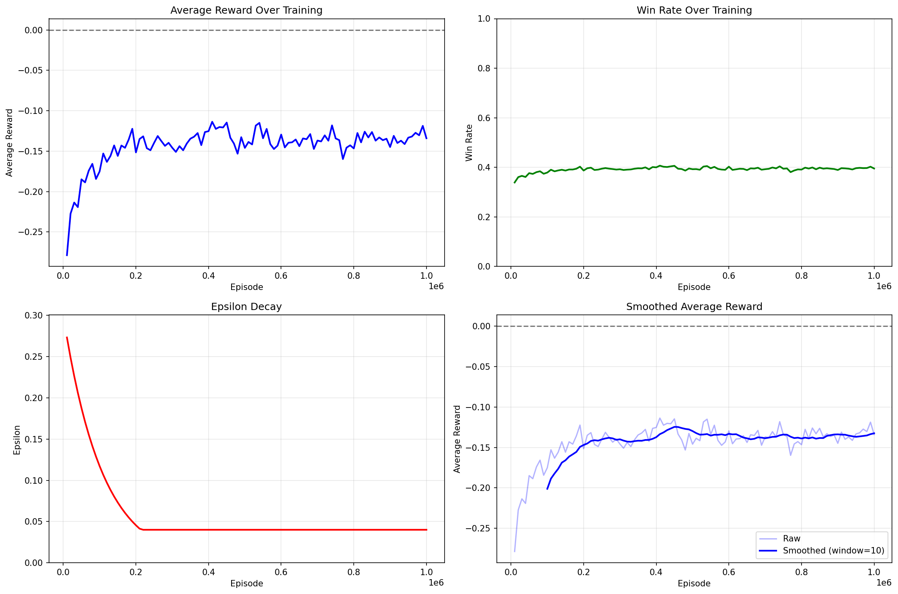

## Project Statement

Blackjack is one of the very few casino games I actually knew the rules of. Basically, you try to beat the dealer through a series of "hitting" and "standing" actions, doing your best to obtain a total higher than the dealer's but not over 21 (this is a bust). The casino always has the winning edge, but this project aims to see how far we, as the players, can get to even the playfield a little.

Sutton and Barto's book on reinforcement learning was my main source of inspiration to build this model, specifically all the logic behind it. Essentially, I assume several conditions, simulate the blackjack environment, and see how much better the trained model performs compared to the mathematically derived basic strategy and a random baseline.

## Installation

First, clone the repository:

```bash
git clone git@github.com:BorgXQ/blackjack-optimizer.git
cd blackjack-optimizer
```
Second, depending on your operating system, activate a virtual environment:

```bash
python -m venv .venv
source .venv/bin/activate   # on Windows, use: .venv\Scripts\activate
```

Finally, install the dependencies:

```bash
pip install -r requirements.txt
```

## Usage

### Play Blackjack

If you're simply trying to play blackjack against a computer, simply run the following:

```bash
python blackjack_game.py
```

### Run Simulation and Analysis

The second part of this project is the simulated blackjack environment that runs for many episodes while the reinforcement learning model learns the "best" outcomes. The following code generates multiple instances of each full training and evaluation cycles:

```bash
python batch_runner.py --runs 25
```

Running this is necessary to proceed with running the cells in `analysis.ipynb`. However, before that, you must also run the following script, which initializes a CSV file containing all the supposed possible combinations given the constraints put forth in the project scope:

```bash
python total_combinations.py
```

After running the two CLI commands above, you can get run all the cells in `analysis.ipynb`. Aside from analyses, the script aggregates the best action-state combinations between the trained agent and basic strategy, creating a new CSV file with which you can perform optimal Blackjack action predictions with.

### Run Prediction

Once you have run `analysis.ipynb`, you can run predictions using the following format:

```bash
# Ex1: Your cards are [3, 3] and the dealer's up-card is a 10
python prediction.py --hand 3 3 --dealer 10

# Ex2: Your cards are [7, 9] after splitting and the dealer's up-card is a 6
python prediction.py --hand 7 9 --dealer 6 --split
```
After running the first example, the output should be look like the following:

```
------------------------------------------------------------------
    player_sum  dealer_visible  usable_ace  can_split  can_double
56           6              10       False       True        True
------------------------------------------------------------------
Best Action: Hit
EV: -0.541377
Source: basic, trained
```

It seems like you should **hit** if you have two 3s against the dealer's 10! But sadly, even the best action yields a heart-wrenching expected return of -0.54 per unit bet. Such is the nature of casino gambling.

## Results

| **Metric** | **Combined Agent** | **Trained Agent** | **Basic Strat Baseline** | **Random Baseline** |
|-----------|------|------|-------------|---------|
| Winrate | 0.4056 | 0.3992 | 0.3901 | 0.2641 |
| Avg Return | -0.1120 | -0.1247 | -0.1489 | -0.4699 |

The trained agent demonstrates a 0.91 percentage point improvement in win rate compared to the basic strategy baseline while achieving a substantially better average return with a 16.3% relative improvement in losses. Both metrics significantly outperform the random baseline, with the trained agent showing 13.51 percentage points higher win rate and 73.5% better average return than random play.

Most notably, the combined agent, which aggregates optimal actions from both the trained agent and basic strategy baseline, achieves the strongest performance across all metrics. This hybrid approach represents a 0.64 percentage point improvement over the trained agent alone and a 1.55 percentage point improvement over the basic strategy. For average returns, it reduces losses to -0.1120, marking a 10.2% relative improvement over the trained agent and 24.8% relative improvement over the basic strategy baseline.

These results demonstrate that while the trained agent successfully learns to outperform traditional heuristics, the greatest gains emerge from intelligently combining learned strategies with established baseline approaches, suggesting that hybrid methodologies can effectively leverage the strengths of both machine learning and conventional strategic frameworks.

 <br>

The win rate over the 1,000,000 episodes remained somewhat consistent with a range between 0.3898 and 0.4095. The average reward dramatically improved in the first 200,000 episodes but then stagnated for the remainder of the training period.

## Discussion

The discussion portion of the project is under construction. Stay tuned!

## Conclusion

You have practically near-zero edge in blackjack even when your strategy is heavily optimized. But if you're going to play anyway, here's a motivation:

[St. Petersburg paradox](https://en.wikipedia.org/wiki/St._Petersburg_paradox) says that the expected values in these games should be infinite, but in actuality, they aren't because they account for extremely rare events (like *absurdly impossible* events). But who's to say you're not going to be that one in a quintillion gambler who wins a thousand times in a row? After all, highly improbable ≠ impossible. It's not delusion; it's being risk-loving!

On a serious note, understand bankroll management and don't gamble what you can't afford to lose.